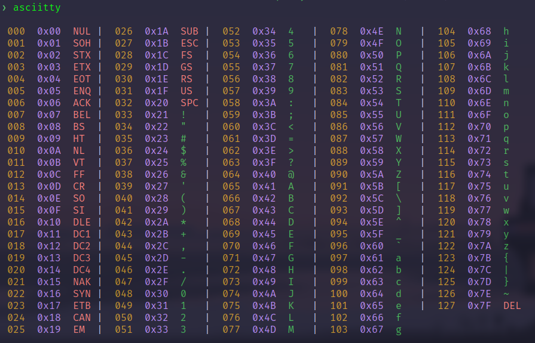

# Asciitty - Byte Visualization Swiss Army Knife 


I'll let the help text explain for now. I'm too sleep deprived to further explain the utility at the moment.

```
Usage: asciitty [FLAGS] [OPTIONS]

Flags <default>:
    --help       <false>        Show this help message.
    --hex        <true>         Show hexadecimal representation
    --dec        <true>         Show decimal representation
    --oct        <false>        Show octal representation
    --bin        <false>        Show binary representation
    --chr        <true>         Show raw ASCII character representation
    --horizontal <false>        Lay out bytes horizontally.
    --color      <true>         Colorize output via ANSI.
    --stdin      <false>        Read bytes from stdin.

    Flags can be negated by prefixing with 'no-', e.g. --no-hex
    to disable flags set by default.

Options <default>:
    --columns   <4>    Number of columns to display.
    --width     <40>   Width of each column.
    --separator <|>    Separator between columns.

    --bytes  <ascii>   Which bytes to display.
             ---------------------------------
             ascii | extended | asciix | 1,2,3,4 ..etc
             ---------------------------------
             When providing specific values, the following formats are
             accepted: 0xN (hex), 0oN (octal), 0bN (binary), N (decimal).
             Or a range of values: 0..127, 0x00..0x7F, etc, or any combination
             of the above, e.g. 1,0x02,0b1100,1..10 etc. Duplicates are not
             ignored, thus:

             1,0x02,0b1100,1..10 =>
                1, 2, 3, 1, 2, 3, 4, 5, 6, 7, 8, 9, 10

             Ranges are inclusive.

             ascii, extended, and asciix can be included in the separated list
             e.g. ascii,extended would be the same as asciix, likewise, 
             so would 0..127,extended.
             --------------------------------

    --string <None>    Display bytes from a string.
    --file <None>      Read bytes from a file. 

    When using --stdin, --string, or --file, the default value of --bytes
    is ignored unless explicitly provided. If multiple sources are provided,
    the bytes are appended in the order the arguments are provided.
```
